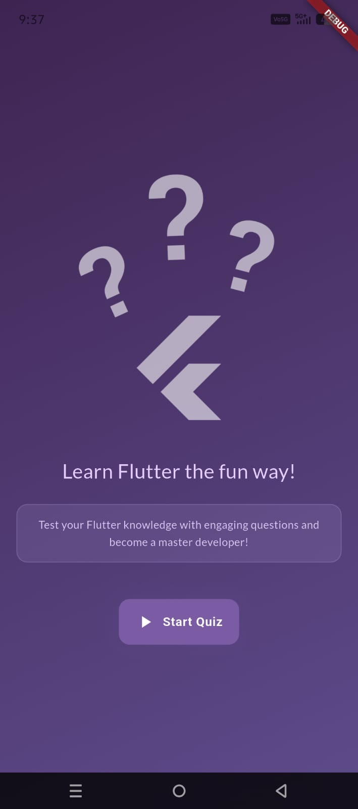
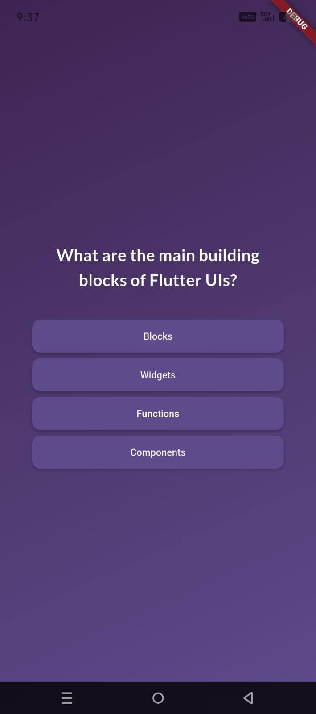
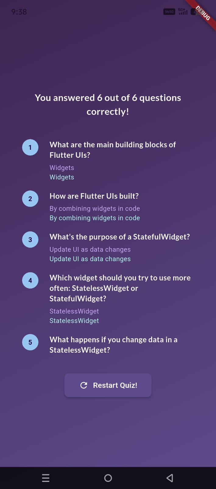

# Flutter Quiz App

A simple and interactive Quiz App built using Flutter. This app helps users test their Flutter knowledge in a fun and engaging way.

## App Flow

1. User opens the app
2. Clicks on **Start Quiz**
3. Answers all 6 questions
4. Views result summary
5. Can restart the quiz

---

## App Screenshots

<table align="center">
  <tr>
    <td></td>
    <td></td>
    <td></td>
  </tr>
</table>

---
## Prerequisites
Make sure you have the following installed:

- Flutter SDK
- Android Studio / VS Code
- An emulator or a physical device
---

## Getting Started

Follow these steps to set up and run the project locally on your machine.

1. Clone the repository:

```bash
git clone https://github.com/themaverick27/quiz_app.git
```

2. Navigate to the Project Directory

```bash
cd quiz_app
```

3. Install Dependencies

```bash
flutter pub get
```

4. Run the Application

```bash
flutter run
```
---

## Project Structure
<pre>
lib/
├── data/
│ └── questions.dart
├── model/
│ └── quiz_question.dart
├── questions_summary/
│ └── question_identifier.dart
│ └── question_summary.dart
│ └── summary_item.dart
├── answer_button.dart
├── main.dart
├── questions_screen.dart
├── quiz.dart
├── results_screen.dart
├── start_screen.dart
</pre>
---

## Future Improvements

- Add timer for each question ⏱️
- Fetch questions from an API 🌐
- Add categories/difficulty levels 🎮

---

## Contributing

Feel free to fork this repo and improve the app. Contributions are welcome!
---
